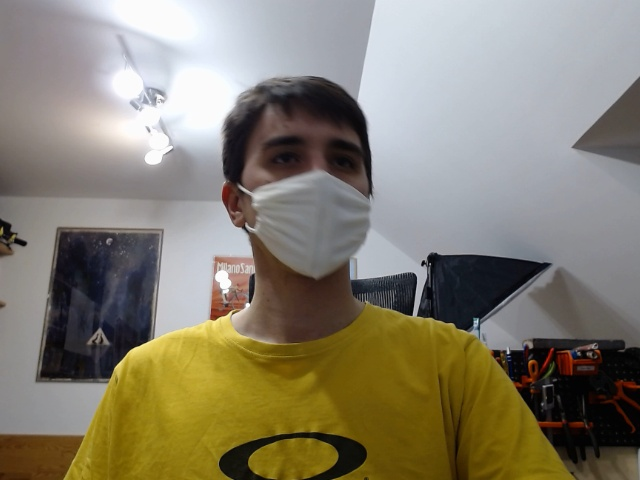
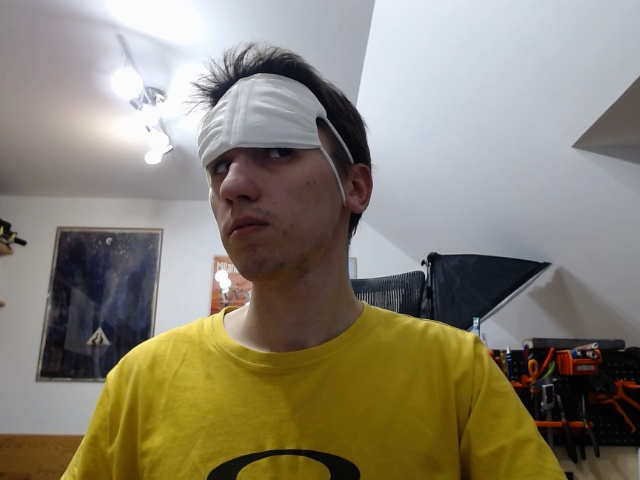
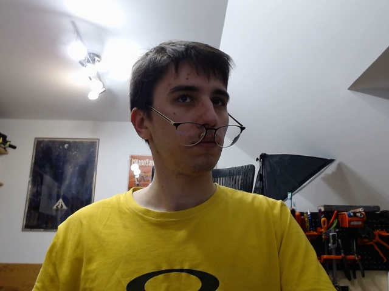

# Proper mask usage detection

This projects target is to create a real time mask detector. During pandemics it is very important to keep ourselves safe by keeping masks on.

## The program is supposed to detect three classes:

1. Mask is on, everything is correct.

   

2. Mask is partially on, good for trying.

   

3. Mask is not on, you should put it now.

   

### LINKS:

1. https://tensorflow-object-detection-api-tutorial.readthedocs.io/en/latest/install.html - TF OD API 
2. https://github.com/tzutalin/labelImg - labelImg program